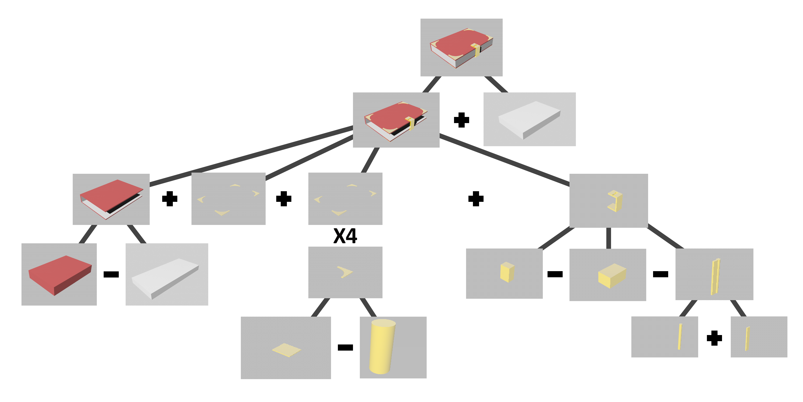
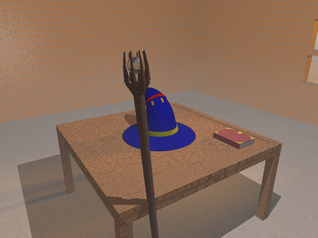
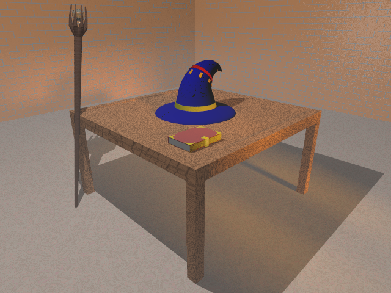
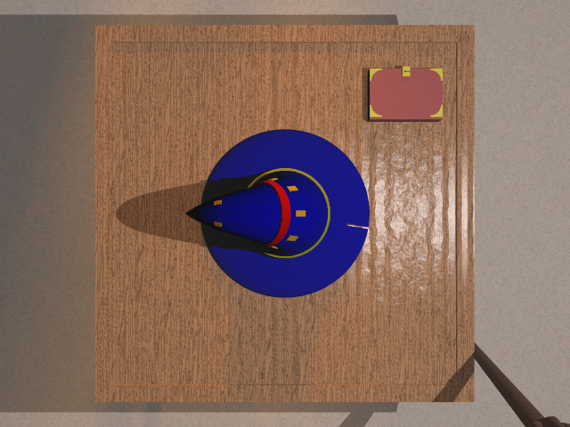
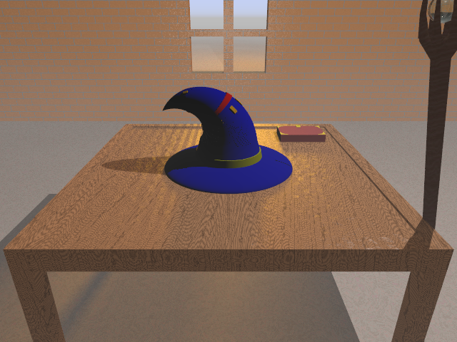
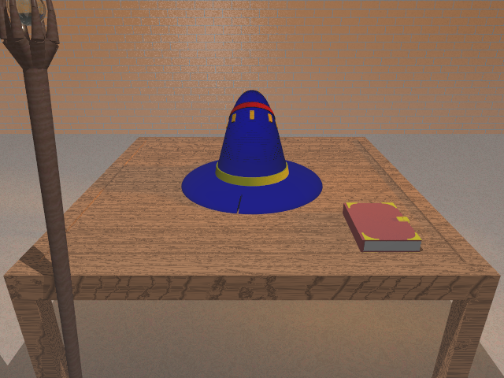

# Trabalho de Computação Gráfica - POV-Ray
Primeiro trabalho desenvolvido em 2018 para a matéria de Computação Gráfica do curso de Bacharelado em Ciência da Computação da UNIOESTE - Foz.

Caso o mesmo fosse desenvolvido atualmente, diversas abordagens seriam diferentes.

## Arvore CSV

## Resultados

